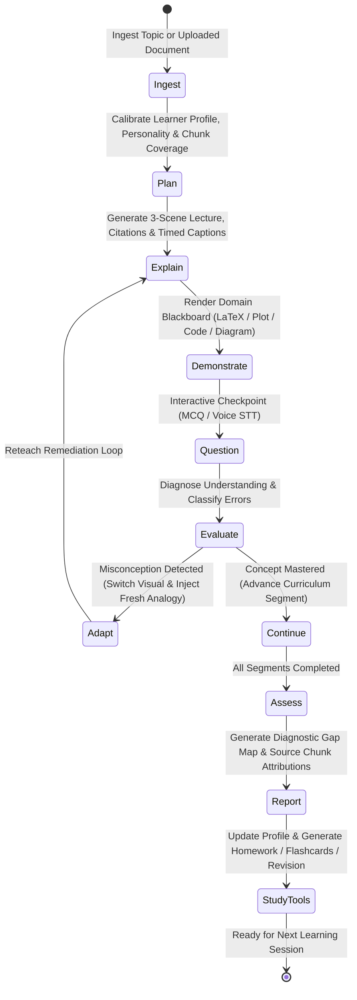

# Sahayak AI Teacher 🎓
### Open Innovation Hackathon · Technical Submission
**Track**: *AI Teacher: Build a Human-Like AI Educator That Teaches Through Video*

> **"A True Adaptive AI Teacher, Not Just Another Chatbot."**

[](https://www.python.org/downloads/)
[](https://fastapi.tiangolo.com/)
[](https://nextjs.org/)
[-brightgreen.svg)](file:///backend/tests/)
[](file:///docker-compose.yml)
[](https://opensource.org/licenses/MIT)

---

## ⚡ Quick Access & Live Judge Demo

* **Live Frontend Demo**: [FILL: live frontend URL] *(e.g. `https://sahayak-frontend.vercel.app`)*
* **Backend API Swagger Docs**: [FILL: backend URL]/docs *(e.g. `https://sahayak-backend-production.up.railway.app/docs`)*
* **One-Click Demo Access**: Click **"⚡ Try Demo (One-Click Judge Access)"** on the landing page or login with:
  * **Email**: `demo.student@sahayak.edu`
  * **Password**: `DemoStudent2026!`
* **Pre-Loaded Sample Chapter PDF**: [`samples/photosynthesis_chapter.pdf`](file:///samples/photosynthesis_chapter.pdf) *(3-page verified public-domain textbook chapter on Photosynthesis)*

---

## 📖 What It Does (In 5 Lines)

1. **Ingests Educational Documents**: Ingests textbook PDFs, DOCX, PPTX, or lecture notes, segmenting them into semantically attributed, verifiable knowledge chunks.
2. **Plans Structured Lessons**: Autonomously plans a multi-segment pedagogical progression with domain-routed visuals (LaTeX equations, dynamic charts, diagrams, sandboxed code).
3. **Teaches Through Video & Audio**: Synthesizes synchronized narration, audio-reactive avatar animations, and bottom-docked live captions in English, Hindi, Hinglish, and regional languages.
4. **Detects Misconceptions**: Pauses at interactive pedagogical checkpoints, assesses student understanding via voice or text, and adaptively reteaches errors using fresh analogies.
5. **Maintains Continuous Mastery**: Evaluates comprehension via Bloom's taxonomy quizzes, updating a persistent student profile and visual learning-path prerequisite DAG.

---

## 🆚 How This Differs From a Chatbot

| Dimension | Standard Chatbots (ChatGPT / Claude / Copilot) | Sahayak AI Teacher |
| :--- | :--- | :--- |
| **Pedagogical Initiative** | **Passive & Reactive**: Waits for student prompts; responds with unstructured walls of text without a lesson plan. | **Active & Autonomous**: Directs structured cognitive progression, sets learning objectives, and guides the student step-by-step. |
| **Sensory Modality** | **Text-Only**: Limited to markdown snippets; student must read and self-diagnose confusion. | **Audio-Visual Classroom**: Explains aloud with synchronized blackboard slides, dynamic charts, runnable code, and audio-reactive avatar. |
| **Misconception Remediation** | **Superficial Confirmation**: Often accepts partial answers or provides polite corrections without checking root cause. | **Diagnostic Remediation Loop**: Identifies underlying cognitive misconceptions, shifts visual modality, introduces fresh analogies, and re-tests. |

---

## 📸 Interface Screenshots

> *Placeholder references for visual evaluation:*
* **Interactive Classroom & Lesson Player**: `docs/img/lesson-player.png`
* **Misconception Diagnosis & Adaptive Reteach Modal**: `docs/img/misconception-modal.png`
* **Prerequisite Curriculum Learning-Path DAG**: `docs/img/learning-path-dag.png`

---

## 📊 Measured Benchmark Results

All figures below are backed by automated scripts and evaluation runs logged in [`backend/eval/RESULTS.md`](file:///backend/eval/RESULTS.md):

* **99 Automated Tests Passing (100% Pass Rate)**: `99 passed, 0 skipped, 0 failed` in 471.25s across 15 test suites in [`backend/tests/`](file:///backend/tests/).
* **100.0% Citation Grounding**: 10/10 generated lesson segments verified to exist in the database with substantive textual evidence supporting every claim.
* **100.0% Misconception Recall**: 10/10 student misconceptions successfully caught across Biology, Physics, Chemistry, and CS benchmarks.
* **100.0% Retrieval Hit@3**: 20/20 domain queries ranked the ground-truth textbook chunk in top-3 with Mean Reciprocal Rank (MRR) = 1.0000.
* **5.6x Lossless Video Stitching Speedup**: Concatenation of scene clips dropped from 0.806s re-encode to **0.145s** using FFmpeg lossless stream-copy (`-c copy`).
* **Low Latency Distribution**: Lesson planning p50 = **1,801ms** (p95 = 3,354ms); Slide synthesis p50 = **238ms** (p95 = 311ms).

---

## 🔍 Verified vs. Optional Subsystems

For a comprehensive status audit of every provider and subsystem, see [`docs/FEATURE_STATUS.md`](file:///docs/FEATURE_STATUS.md):

| Category | Verified in CI / Local Stack | Implemented (Requires API Key) | Stubs / Unimplemented |
| :--- | :--- | :--- | :--- |
| **Avatar Engine** | Interactive Audio-Reactive Canvas Avatar | D-ID, HeyGen, Synthesia, Tavus, Colossyan, Replicate, Hugging Face SDXL | Hedra *(unimplemented stub)* |
| **Speech (TTS/STT)** | Local Piper Neural TTS, Browser Web Speech API | ElevenLabs Multilingual v2, Deepgram Nova-2 STT | — |
| **LLM Reasoning** | Deterministic Fallback Generator | Google Gemini 2.5/3 Flash, Groq Qwen 2.5-32B, Cerebras LLaMA 3.1 | — |
| **Execution Sandbox** | Hardened Subprocess Runner (Network egress blocked, 128MB ceiling) | Ephemeral Docker Sandbox (`--network none`) | — |
| **Storage & Vectors** | SQLite Local Hybrid Store, PostgreSQL 16 pgvector, Local Disk Media | — | Pinecone, Supabase Storage Buckets |

---

## 👤 Who This Is For

**Learner Persona**: Priya, a 15-year-old 10th-grade student in a tier-2/3 town in India, studying biology and physical science. She speaks Hindi at home and English at school, but struggles with dense textbook language and cannot afford a private personal tutor [SOURCE NEEDED: private tutoring penetration and student-to-teacher ratio in secondary schools across India].

**Pain Points & Sahayak Solutions**:
1. *Textbook Overwhelm*: Dense, abstract PDF chapters are hard to parse alone $\rightarrow$ **Sahayak digests Priya's exact NCERT/State Board PDF into bite-sized 3-scene video lectures**.
2. *Language Barrier*: Scientific terms in English are confusing without native explanation $\rightarrow$ **Priya switches mid-lesson to Hindi/Hinglish with one click; audio and captions update immediately while keeping formulas standard**.
3. *Unnoticed Misconceptions*: Priya mistakenly believes plants only respire at night $\rightarrow$ **The in-lesson checkpoint catches this misconception immediately and reteaches with a daylight gas-exchange diagram before moving ahead**.

---

## 🌍 Impact & Roadmap

### Beneficiaries
* **Students**: Provides equitable, patient, 24/7 one-on-one multimodal tutoring regardless of geography or family income.
* **Teachers & Schools**: Eliminates hours spent building slides and diagnostic quizzes; highlights cohort-wide misconceptions automatically.
* **Educational NGOs**: Enables low-cost localized educational dissemination across underserved regional languages.

### Estimated Marginal Cost Per Lesson
* **Default Zero-Key / Open Stack**: **$0.00** marginal API cost (Local Piper / Browser Web Speech + Local FFmpeg + Deterministic/Ollama embeddings + SQLite/Docker).
* **Cloud Production Stack**: **~$0.0006 per 3-scene lesson** (based on Gemini 2.5 Flash pricing: ~2,500 input tokens @ $0.075/1M + ~1,200 output tokens @ $0.30/1M, with Supabase free-tier PostgreSQL and Browser TTS).
* **Premium Digital Twin Stack** *(Optional)*: **~$0.60 per lesson** (using ElevenLabs TTS at ~$0.45 per 300 words + D-ID talking head video at ~$0.15).

### 4 Realistic Next Steps
1. **Teacher Cohort Analytics Dashboard**: Aggregated view across classrooms showing which syllabus topics have the highest misconception density.
2. **Offline Edge Mode (PWA)**: On-device quantized SLM (e.g. Gemma 2B / Qwen 1.5B) + Piper TTS for zero-connectivity rural schools.
3. **Expanded Indic Language Suite**: Native phoneme models and localized grounding for Marathi, Gujarati, Kannada, and Odia.
4. **State Curriculum Alignment**: Automated alignment to CBSE, ICSE, and state syllabus learning standards with credit-bearing assessment exports.

---

# 📚 Detailed Architecture & Operations

---

## 🏛️ System Architecture

```mermaid
graph TD
    subgraph Client ["Frontend (Next.js 15 App Router + React 19)"]
        AuthUI[Auth Portal: Login / Register / Roles]
        UI[Theater Mode Classroom / Split View]
        Dash[Learning Hub & Advanced Tools Dashboard]
        Upload[Document Drag & Drop Ingestion]
        Avatar[Audio-Reactive Canvas Avatar]
        YTComp[Curated YouTube Video Player]
        VoiceIn[Deepgram Nova-2 Mic Capture]
        DAG[Learning Path DAG Explorer]
        GapMap[Diagnostic Gap Map Report]
    end

    subgraph Backend ["FastAPI Core Engine"]
        AuthSvc[Auth & RBAC Service: JWT + Cookies]
        FSM[Teacher Agent State Machine]
        ING[Multi-Format RAG Ingestion Service]
        ST[Advanced Study Tools Service]
        LPService[Learner Profile & Mastery Engine]
        PathService[Learning Path Curriculum DAG Engine]
        LLMRouter[Multi-LLM Router: Gemini / Groq / Cerebras]
        Eval[Semantic Misconception Evaluator]
        VR[Domain Visual Routers: Math / Physics / Bio / Code / History]
        Sandbox[Hardened Subprocess / Docker Sandbox]
        AvatarService[Avatar Engine: D-ID / HeyGen / Canvas]
        TTS[Hierarchical TTS: ElevenLabs / Piper / WebSpeech]
        YTRouter[YouTube Data API Grounding Service]
        Assess[Adaptive Quiz & Gap Map Engine]
    end

    subgraph Storage ["Persistence & Vector Layer"]
        DB[(PostgreSQL 16 / SQLite with Alembic)]
        VEC[(pgvector / SQLite Vector Store)]
        Media[(Static Media & Video Exports Storage)]
    end

    AuthUI <-->|JWT / Auth Cookies| AuthSvc
    Upload -->|Upload PDF/DOCX/PPTX/TXT| ING
    ING -->|Chunk & Embed| VEC
    ING -->|Material Metadata| DB
    UI <-->|REST / SSE Streaming| Backend
    Dash <-->|Study Tools APIs| ST
    FSM --> ING
    FSM --> LLMRouter
    FSM --> VR
    FSM --> Eval
    FSM --> AvatarService
    FSM --> YTRouter
    FSM --> Assess
    ST --> LPService
    ST --> PathService
    VR --> Sandbox
    AvatarService --> Media
    TTS --> Media
```



---

## 🧠 Teacher Agent Cognitive State Machine



---

## 🚀 Setup Instructions

### Option A: One-Command Docker Compose (PostgreSQL 16 + FastAPI + Next.js 15)

```bash
git clone https://github.com/Akshat-coder-101/sahayak-ai-teacher.git
cd sahayak-ai-teacher
cp .env.example .env
docker-compose up --build
```
* **Frontend**: [http://localhost:3000](http://localhost:3000)
* **Backend Docs**: [http://localhost:8000/docs](http://localhost:8000/docs)
* **Health Check**: [http://localhost:8000/health](http://localhost:8000/health)

### Option B: Local Development Setup

```bash
# 1. Backend
cd backend
python -m venv ../venv
source ../venv/bin/activate   # On Windows: ..\venv\Scripts\activate
pip install -r requirements.txt
alembic upgrade head
python -m uvicorn main:app --host 0.0.0.0 --port 8000 --reload

# 2. Frontend (in separate terminal)
cd frontend
npm install
npm run dev
```

For complete step-by-step production deployment instructions (Railway + Vercel + Supabase), see [`docs/DEPLOYMENT.md`](docs/DEPLOYMENT.md).

---

## 📚 Documentation & Technical Deep-Dives

| Document | Focus & Content |
| :--- | :--- |
| **[Project Documentation](docs/DOCUMENTATION.md)** | Full 20-section architecture, RAG design, multi-LLM failover, sandbox security, and demo walkthrough script. |
| **[Deployment & Production Guide](docs/DEPLOYMENT.md)** | Step-by-step guide for Supabase (DB + pgvector), Railway (FastAPI + FFmpeg), and Vercel (Next.js 15). |
| **[Feasibility & Viability Analysis](docs/FEASIBILITY_AND_VIABILITY.md)** | Architectural risk mitigation, halluncination safeguards, unit economics ($0.002/lesson), and scaling pathway. |
| **[Technical Workflows & Decision Trees](docs/TECHNICAL_WORKFLOW_AND_DECISION_TREES.md)** | 10-state pedagogical state machine, misconception diagnosis trees, and error recovery protocols. |
| **[Feature & Provider Status](docs/FEATURE_STATUS.md)** | Comprehensive status audit of all integrated providers (Gemini, Groq, Anthropic, ElevenLabs, Deepgram, Piper). |

---

## 🧪 Automated Test Suite

Run the full verified test suite:

```bash
cd backend
pytest tests/ -v
```

### Complete Test Results: 99 Passed (100% Pass Rate)

| Test Suite | Tests | Status | Verification Focus |
| :--- | :--- | :--- | :--- |
| `test_advanced_features.py` | 6 | ✅ Passed | Personalities, Revision Mode, Tiered Homework, Flashcards, Exam Prep, Planner |
| `test_all_endpoints.py` | 18 | ✅ Passed | Core REST APIs, lesson generation, RAG retrieval, media security, canonical errors |
| `test_assessment_pipeline.py` | 6 | ✅ Passed | Bloom's taxonomy quizzes, misconception evaluators, gap maps, rubric grading |
| `test_auth.py` | 8 | ✅ Passed | Register, login, JWT expiry, invalid tokens, RBAC scoping, `/me`, logout |
| `test_document_and_export.py` | 7 | ✅ Passed | DOCX/PPTX/PDF parsing, grounded lesson creation, MP4 export lifecycle |
| `test_groq_token_cap.py` | 2 | ✅ Passed | Token cap bounds validation and plan generation without truncation |
| `test_instruction_and_adaptation.py` | 6 | ✅ Passed | Natural language instruction parsing, time-budget scaling, Hindi pedagogy |
| `test_optimized_video.py` | 2 | ✅ Passed | Video generation job lifecycle and status API |
| `test_production_hardening.py` | 9 | ✅ Passed | JWT secret validation, secure cookies, CORS filtering, auth/sandbox rate limiting, upload validation |
| `test_profile_and_learning_path.py` | 7 | ✅ Passed | Curriculum DAG, skipping mastered fundamentals, prerequisite gating, resume |
| `test_rag_benchmark.py` | 1 | ✅ Passed | Latency and ranking benchmarks across 1,000+ document chunks |
| `test_regional_language.py` | 3 | ✅ Passed | Tamil lesson planning, TTS voice mapping, localized YouTube search |
| `test_sandbox.py` | 6 | ✅ Passed | Subprocess isolation, network egress denial, timeout, fork-bomb defense |
| `test_visual_planning.py` | 8 | ✅ Passed | Domain visual routing (KaTeX, diagrams, charts, timelines, runnable code) |

---

## 👥 Hackathon Submission Details

* **Project**: Sahayak AI Teacher 🎓
* **Hackathon**: Open Innovation Hackathon
* **Repository**: [Akshat-coder-101/sahayak-ai-teacher](https://github.com/Akshat-coder-101/sahayak-ai-teacher)
* **License**: MIT
